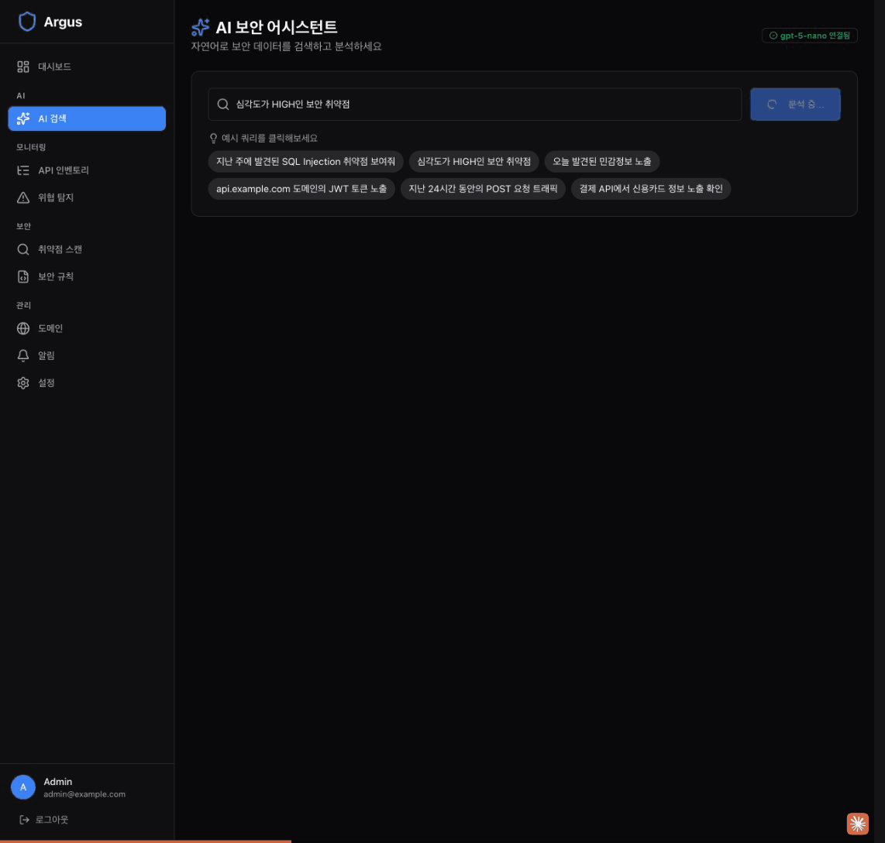

<p align="center">
  <a href="README.md">English</a> |
  <a href="README.ko.md">한국어</a>
</p>

<p align="center">
  
</p>

<h1 align="center">Argus AI</h1>
<p align="center">
  <strong>250개 이상의 YAML 보안 규칙과 AI 기반 위협 분석을 제공하는 API 보안 플랫폼</strong>
</p>

<p align="center">
  <a href="https://github.com/mhb8436/argus-ai-releases/releases"></a>
  <a href="#라이선스"></a>
  
  
  
</p>

<p align="center">
  <a href="#argus-플랫폼">플랫폼</a> |
  <a href="#argus-cli">CLI</a> |
  <a href="#다운로드">다운로드</a> |
  <a href="#비교표">비교표</a>
</p>

---

Argus AI는 API를 발견하고, 분석하고, 보호하는 API 보안 플랫폼입니다. HTTP 트래픽을 수집하여 250개 이상의 YAML 기반 보안 규칙(OWASP API Top 10)으로 분석하고, 민감정보(PII, 자격증명, 토큰)를 탐지하며, 자연어로 위협을 검색할 수 있습니다.

## 두 가지 제품

| | Argus Platform | Argus CLI |
|--|:---:|:---:|
| **유형** | 서버 기반 플랫폼 | 독립 실행 바이너리 |
| **용도** | API 상시 모니터링 | 온디맨드 보안 점검 |
| **인프라** | Kafka, Elasticsearch, PostgreSQL | 불필요 (SQLite 내장) |
| **인터페이스** | 웹 대시보드 (React) | 터미널 (CLI + TUI) |
| **대상** | DevSecOps 팀, SOC | 모의해커, 감리원, 폐쇄망 환경 |

---

<h2 id="argus-플랫폼">Argus Platform (서버)</h2>

### 3단계 보안 라이프사이클

**Discover (발견)** -- API 인벤토리 자동 수집 및 섀도우 API 식별
**Analyze (분석)** -- 250개 이상 보안 규칙 + 민감정보 탐지 (DLP)
**Act (대응)** -- AI 자연어 쿼리 + 실시간 알림

### 주요 기능

- **실시간 트래픽 분석** -- Gateway/Sidecar/Agent를 통한 HTTP 트래픽 수집
- **250개 이상 YAML 보안 규칙** -- SQL Injection, XSS, SSRF, BOLA, Command Injection 등
- **이중 스캔 모드** -- Passive(제로 임팩트) + Active(모의해킹)
- **민감정보 탐지** -- 신용카드(Luhn), 주민등록번호, JWT, 이메일, 전화번호
- **AI 자연어 쿼리** -- "지난 주 SQL Injection 보여줘" (Azure OpenAI / Ollama)
- **자동화 스캔** -- Cron 기반 스케줄 스캔 + 테스트 구성 저장
- **엔터프라이즈 연동** -- Slack, Email, Webhooks 알림 + RBAC + 도메인 필터링

### 아키텍처

```
트래픽 소스              플랫폼                              저장소
                    ┌─────────────────────────────────┐
 Gateway ─────┐    │                                   │
              ├───>│  Collector (:8081)                 │
 Sidecar ─────┤    │       │                           │
              │    │       v                           │
 Log Agent ───┘    │     Kafka                         │──> Elasticsearch
                   │       │                           │
                   │       v                           │
                   │  Analyzer                         │──> PostgreSQL
                   │   ├─ Parser (HTTP 트래픽 파싱)      │
                   │   ├─ Detector (250+ YAML 규칙)     │
                   │   ├─ Sensitive (민감정보 탐지)       │──> Redis
                   │   └─ Notifier (Slack/Email/WH)    │
                   │       │                           │
                   │       v                           │
                   │  Dashboard API (:8080)            │
                   │       │                           │
                   │       v                           │
                   │  React UI (:3000)                 │
                   └─────────────────────────────────┘
```

---

<h2 id="argus-cli">Argus CLI -- 독립 실행 보안 점검 도구</h2>

250개 이상 규칙이 내장된 단일 Go 바이너리. 서버, 데이터베이스, 인터넷 연결이 필요 없습니다. Burp Suite처럼 동작하지만 터미널에서 실행됩니다.

```bash
# Passive 스캔 (운영 환경에 안전)
argus-cli scan passive https://api.example.com

# Active 스캔 (공격 페이로드 전송)
argus-cli scan active https://api.example.com

# Full 스캔 (크롤링 + passive + active)
argus-cli scan full https://api.example.com

# 프록시 모드 (브라우저 트래픽 가로채기)
argus-cli proxy start --port 8082 --passive-scan

# KISA 웹 취약점 점검
argus-cli scan kisa https://api.example.com --level 2 --output report.xlsx

# HTML 리포트 생성
argus-cli report generate --format html --output report.html
```

### CLI 도구 목록

| 도구 | 설명 | Burp Suite 대응 기능 |
|------|------|---------------------|
| **Proxy** | HTTP/HTTPS 트래픽 가로채기 및 분석 | Proxy |
| **Repeater** | 요청 수정 후 재전송 | Repeater |
| **Intruder** | 페이로드 자동 퍼징 | Intruder |
| **Scanner** | 250+ YAML 규칙, passive + active | Scanner |
| **Crawler** | 엔드포인트 및 폼 자동 발견 | Spider |
| **Decoder** | Base64, URL, hex 인코딩/디코딩 | Decoder |
| **Comparer** | 두 응답 비교 분석 | Comparer |
| **Sequencer** | 토큰 랜덤성 분석 | Sequencer |

### KISA 웹 취약점 점검

[KISA](https://www.kisa.or.kr/) 웹 취약점 점검 28개 항목(WEB-001 ~ WEB-028)을 자동으로 점검하고 Excel 리포트를 생성합니다.

| 레벨 | 항목 수 | 설명 |
|------|-------:|------|
| Level 0 (Passive) | 7 | 디렉토리 인덱싱, 정보 노출, 세션 만료, 쿠키 보안 |
| Level 1 (Semi-active) | 9 | 헤더 점검, 인증 테스트 |
| Level 2 (Active) | 12 | SQLi, XSS, SSRF, 커맨드 인젝션 |

---

<h2 id="다운로드">다운로드</h2>

[Releases](https://github.com/mhb8436/argus-ai-releases/releases) 페이지에서 최신 바이너리를 다운로드하세요.

| 플랫폼 | 아키텍처 | 바이너리 |
|--------|---------|---------|
| macOS | Apple Silicon (arm64) | `argus-cli-darwin-arm64` |
| macOS | Intel (amd64) | `argus-cli-darwin-amd64` |
| Linux | amd64 | `argus-cli-linux-amd64` |
| Windows | amd64 | `argus-cli-windows-amd64.exe` |

```bash
# macOS (Apple Silicon)
curl -L -o argus-cli https://github.com/mhb8436/argus-ai-releases/releases/latest/download/argus-cli-darwin-arm64
chmod +x argus-cli
./argus-cli --help

# Linux
curl -L -o argus-cli https://github.com/mhb8436/argus-ai-releases/releases/latest/download/argus-cli-linux-amd64
chmod +x argus-cli
./argus-cli --help
```

---

<h2 id="비교표">경쟁 제품 비교</h2>

| 기능 | Argus | Akto | Burp Suite | ZAP | Nuclei |
|------|:-----:|:----:|:----------:|:---:|:------:|
| API 보안 특화 | 예 | 예 | 부분 | 부분 | 부분 |
| YAML 기반 규칙 | 250+ | 208 (OSS) | 비공개 | 아니오 | 8000+ |
| 커스텀 규칙 | 예 | 예 | 확장 기능 | 스크립트 | 예 |
| Passive + Active 스캔 | 둘 다 | 둘 다 | 둘 다 | 둘 다 | Active만 |
| 민감정보 탐지 (DLP) | 예 | 예 | 아니오 | 아니오 | 아니오 |
| AI 자연어 쿼리 | 예 | 아니오 | 아니오 | 아니오 | 아니오 |
| 독립 실행 CLI (폐쇄망) | 예 | 아니오 | 예 | 예 | 예 |
| 실시간 트래픽 분석 | 예 | 예 | 예 | 예 | 아니오 |
| KISA 웹 취약점 점검 | 28개 항목 | 아니오 | 아니오 | 아니오 | 아니오 |
| Burp Suite 유사 도구 (proxy, intruder, repeater) | 예 (CLI) | 아니오 | 예 (GUI) | 부분 | 아니오 |

---

## 보안 규칙 (250+)

YAML 기반 22개 이상 카테고리:

| 카테고리 | 규칙 수 | 예시 |
|---------|-------:|------|
| Injection Attacks (SQLi, NoSQLi, XXE) | 30+ | Error-based, Union-based, Blind SQLi |
| Cross-Site Scripting (XSS) | 9 | Reflected, DOM-based, 인코딩 우회 |
| Command Injection | 18 | Shell, Struts, Spring, Tomcat RCE |
| Server-Side Request Forgery | 8 | AWS/Azure/GCP 메타데이터 리다이렉트 |
| Broken Authentication | 25+ | JWT, 2FA 우회, Credential Stuffing |
| Security Misconfiguration | 25+ | 기본 계정, 노출된 패널, 디버그 엔드포인트 |
| Local File Inclusion | 11 | 경로 탐색, 디렉토리 탐색 |
| 민감정보 탐지 | 5종 | 신용카드, 주민등록번호, JWT, 이메일, 전화번호 |
| 기타 | | CORS, CRLF, SSTI, Rate Limiting, GraphQL |

---

## 기술 스택

| 계층 | 기술 |
|------|------|
| Backend | Go 1.21+, Fiber v2 |
| Frontend | React 18, TypeScript, Vite |
| AI/LLM | Azure OpenAI, Ollama (로컬) |
| Database | PostgreSQL, Elasticsearch |
| Message Queue | Apache Kafka |
| Cache | Redis |
| CLI Storage | SQLite (내장) |

---

## 문의

문의사항은 [이슈](https://github.com/mhb8436/argus-ai-releases/issues)를 등록해 주세요.

---

<h2 id="라이선스">라이선스</h2>

AGPL-3.0 with Commons Clause

Copyright (c) 2026 Argus Contributors
